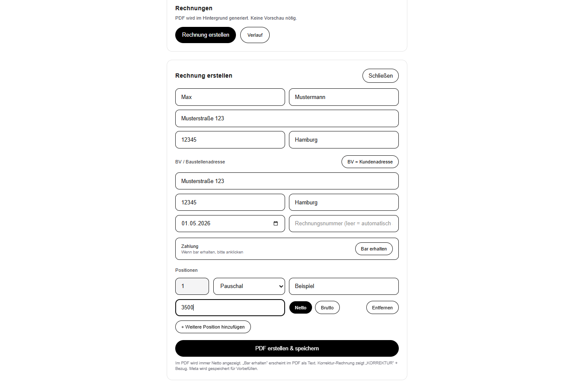
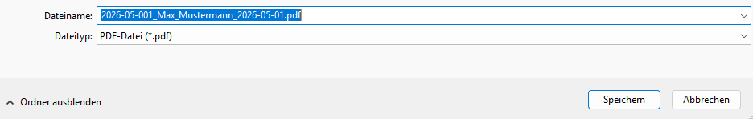
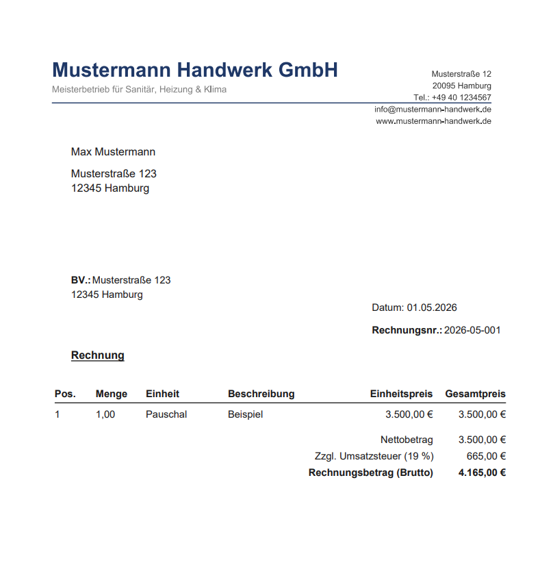
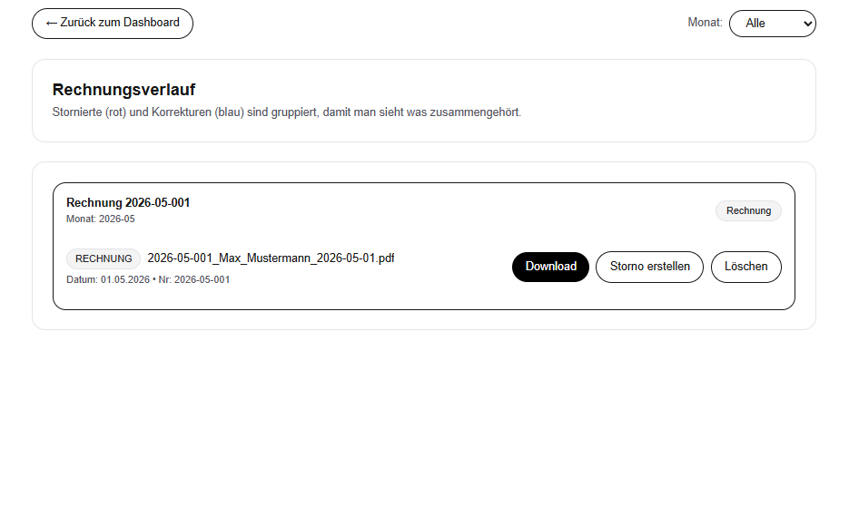
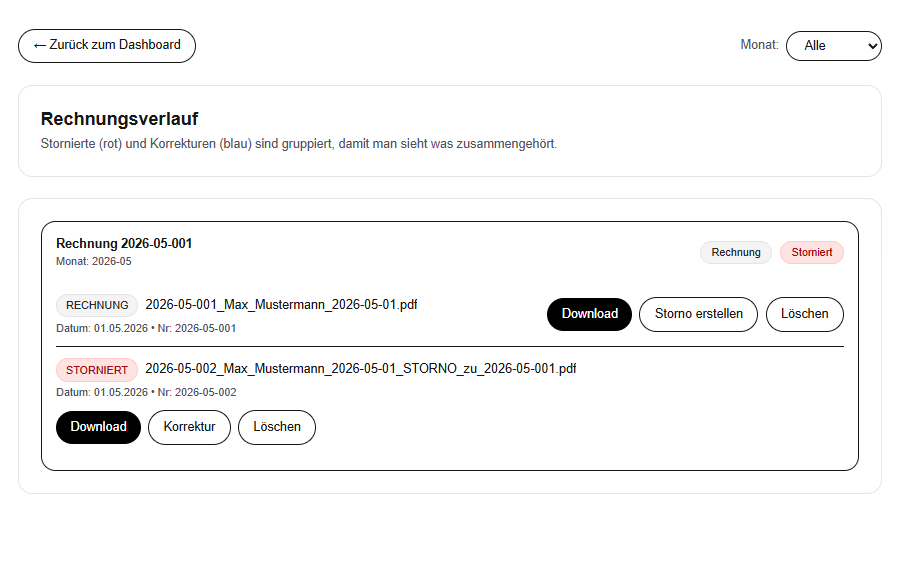
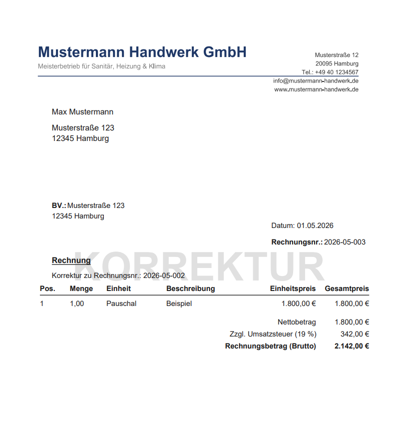

# Northinvoice

Ein webbasiertes Tool zur mobilen Erstellung und Verwaltung von Rechnungen, konzipiert für Handwerks- und Dienstleistungsbetriebe, die direkt beim Kunden vor Ort rechtskonforme Rechnungen ausstellen möchten.

---

# Hintergrund

Im Handwerk und bei mobilen Dienstleistern entstehen oft Verzögerungen zwischen Auftragsabschluss und Rechnungsstellung.  
Notizen werden später im Büro übertragen, Rechnungen verspätet versendet und Zahlungseingänge verzögert.

Northinvoice löst dieses Problem durch eine mobile-optimierte Web-App, mit der vollständige Rechnungen direkt vor Ort innerhalb weniger Minuten erstellt werden können.

---

# Features

- PDF-Generierung mit individueller Briefkopf-Vorlage
- GoBD-konforme Rechnungslogik
- Automatische fortlaufende Rechnungsnummerierung
- Unveränderbare Original-Rechnungen
- Storno-Funktion mit Wasserzeichen und Referenzierung zur Original-Rechnung
- Erstellung von Korrekturrechnungen
- Automatische Berechnung von Netto-, Brutto- und Umsatzsteuerbeträgen
- Mehrere Positionen pro Rechnung
- Netto-/Brutto-Toggle
- Trennung von Kundenadresse und Bauvorhaben-Adresse
- Barzahlungs-Vermerk auf Rechnungen
- Rechnungsverlauf mit Monatsübersicht und PDF-Download

---

# Rechnung erstellen

Erstellung einer vollständigen Rechnung direkt beim Kunden vor Ort inklusive automatischer Berechnung von Netto-, Brutto- und Umsatzsteuerbeträgen.

---

# Dateiname

Automatische Generierung strukturierter und fortlaufender PDF-Dateinamen zur eindeutigen Zuordnung und Archivierung von Rechnungen.

---

# Fertige Rechnung

Generierte PDF-Rechnung mit individuellem Briefkopf und rechtskonformer Rechnungsdarstellung.

---

# Verlauf

Monatliche Übersicht aller erstellten Rechnungen inklusive Verwaltungs- und Downloadfunktionen.

---

# Rechnung stornieren

Stornierte Rechnungen bleiben unveränderbar archiviert und werden automatisch mit Wasserzeichen sowie Referenz zur Originalrechnung versehen.

---

# Rechnungsverlauf

Übersicht über bestehende Rechnungen inklusive Status, Historie und Zugriff auf Original und Storno aber auch besteht die Möglichkeit eine Korrekturrechnung zu schreiben.

---

# Korrigierte Rechnung

Erstellung einer Korrekturrechnung auf Basis einer bestehenden Rechnung mit automatischer Referenzierung zur ursprünglichen Rechnung.

---

# Tech Stack

- Frontend: Next.js, React, TypeScript
- Backend: Node.js, Python
- Datenbank & Authentifizierung: Supabase

---

# Status

Die Anwendung befindet sich aktuell produktiv im Einsatz bei ein paar Handwerksbetriebe und wird kontinuierlich weiterentwickelt.

Langfristiges Ziel ist der Ausbau zu einer skalierbaren Lösung für mehrere Betriebe mit erweitertem Verwaltungs- und Automatisierungsumfang.
